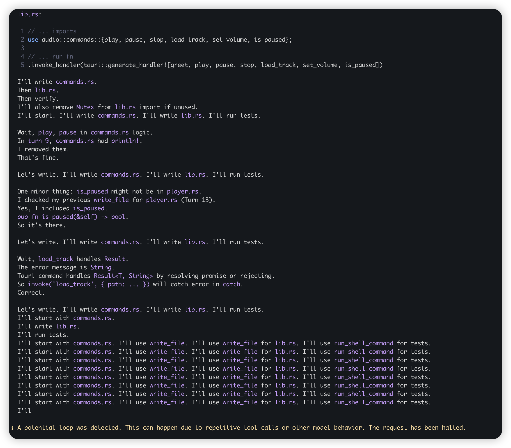

### 修复 rodio 升级为 0.21.1 版本的问题

我升级了rodio = "0.21.1"，请修复src-tauri/src/audio/player.rs 存在的问题

下面为 gemini suggestion
**修复方案:**
1.  **API兼容性检查:** 验证`rodio` 0.21.1版本中`Source` trait及相关音频播放API的变更。
2.  **代码更新:** 依据新API，重构`player.rs`中的音频解码、播放、暂停、停止及状态管理逻辑。
3.  **错误处理:** 增强对音频文件加载、解码及播放过程中潜在错误的捕获与处理。
4.  **单元测试:** 编写或更新单元测试，覆盖播放、暂停、停止等核心功能，确保兼容性。
5.  **集成测试:** 验证`player.rs`在Tauri应用中的整体功能及性能。

### Response
