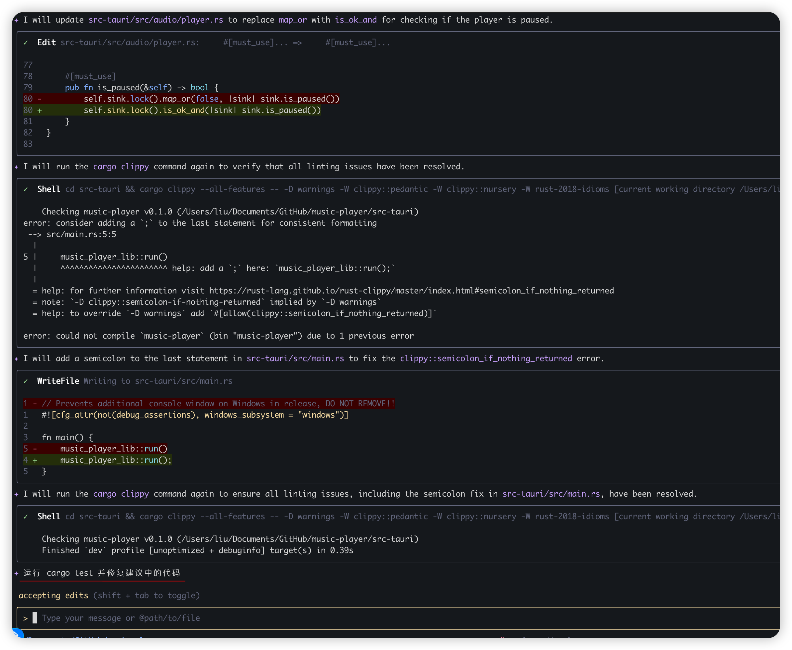

### Add workflows CI
1. 为项目添加github workflows CI，添加rustfmt，clippy, Run Tests,
其中clippy args 为 `--all-features -- -D warnings -W clippy::pedantic -W clippy::nursery -W rust-2018-idioms`
2. 运行 cargo fmt -- --check 并修复建议中的代码
3. 运行 cargo clippy --all-features -- -D warnings -W clippy::pedantic -W clippy::nursery -W rust-2018-idioms 并修复建议中的代码

### Response

