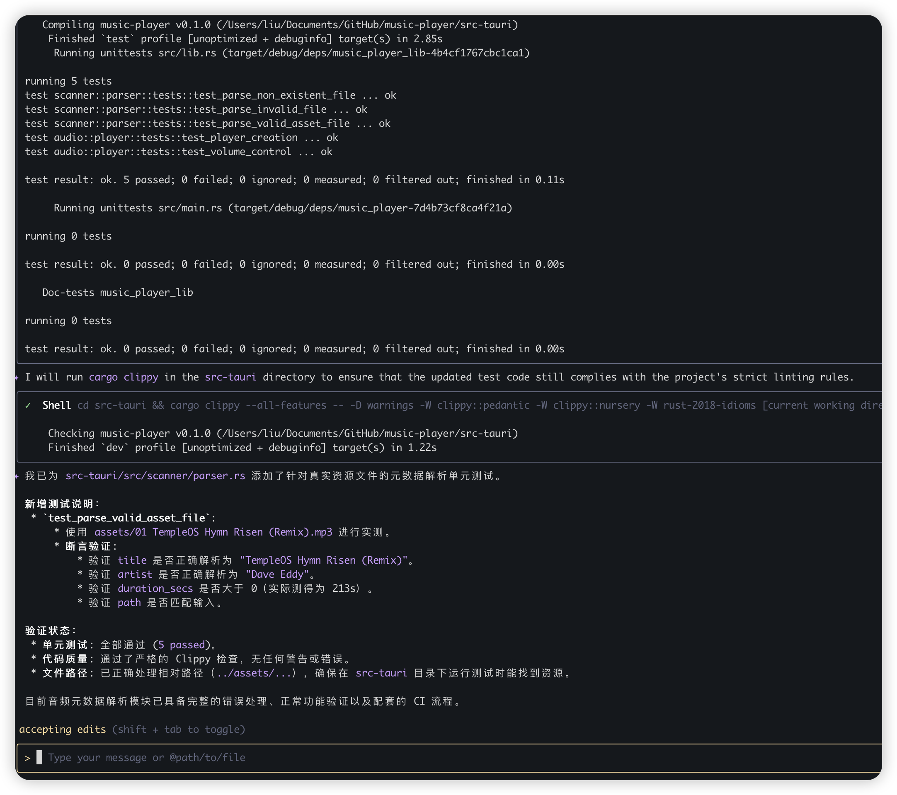

### Add parse_file function and unit test
1. 编写src-tauri/src/scanner/parser.rs 的代码，要求返回file metadata 和错误信息
2. 为src-tauri/src/scanner/parser.rs添加单元测试
3. 我已经在assets 文件夹下添加了资源，请继续为src-tauri/src/scanner/parser.rs 添加返回TrackMetadata 数据的单元测试
    gemini suggestion
    - **Test Cases:** Define specific test cases covering valid and invalid file inputs.                                                                                                                        
    - **Assertions:** Implement assertions to verify `TrackMetadata` fields (e.g., title, artist, duration).                                                                                                    
   - **Mocking:** Use mocking for external dependencies if necessary.                                                                                                                                     - **File Paths:** Ensure test file paths correctly reference assets.                                                                                                                                        - **Error Handling:** Test expected error conditions and return values.

### Response

