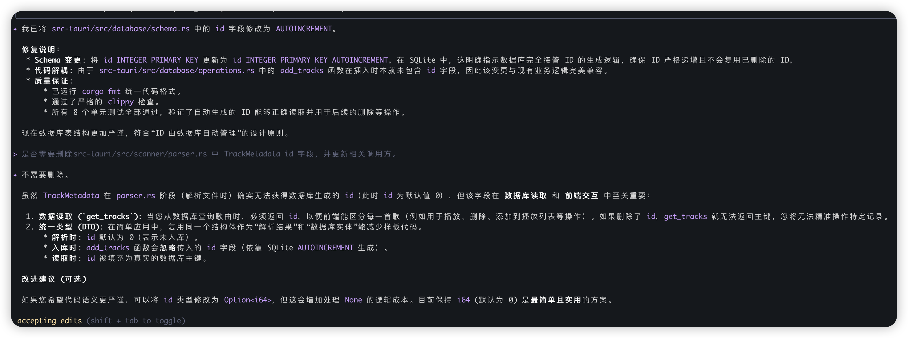

1. 根据TrackMetadata 编写src-tauri/src/database/operations.rs 代码，并编写add_tracks，get_tracks，delete_tracks函数, get_tracks需要支持title 查询, 并为这些函数添加单元测试。之后运行 cargo fmt -- --check, cargo clippy --all-features -- -D warnings -W clippy::pedantic -W clippy::nursery -W rust-2018-idioms 完成code format

gemini suggestion
**Implementation Details:**

  *   **Database Schema:** Assume `TrackMetadata` maps to a database table with columns for `id` (primary key), `title`, `artist`, `album`, `duration`, `filepath`.
  *   **`add_tracks`:**
      *   Input: `Vec<TrackMetadata>`.
      *   Output: `Result<(), Error>`.
      *   Logic: Insert multiple tracks into the database. Handle potential errors.
  *   **`get_tracks`:**
      *   Input: `Option<String>` (for title query).
      *   Output: `Result<Vec<TrackMetadata>, Error>`.
      *   Logic: Retrieve tracks. If `title` is `Some`, filter by title (case-insensitive partial match). If `None`, retrieve all tracks.
  *   **`delete_tracks`:**
      *   Input: `Vec<i64>` (track IDs).
      *   Output: `Result<(), Error>`.
      *   Logic: Delete tracks by their IDs.
  *   **Unit Tests:**
      *   Create a `tests` module within `operations.rs`.
      *   Test `add_tracks` with valid and invalid data.
      *   Test `get_tracks` with and without title filters, including edge cases (no matches, multiple matches).
      *   Test `delete_tracks` with existing and non-existing IDs.
      *   Ensure tests use an in-memory or temporary database for isolation.
  *   **Code Formatting & Linting:** Execute `cargo fmt -- --check` and `cargo clippy --all-features -- -D warnings -W clippy::pedantic -W clippy::nursery -W rust-2018-idioms`.

2. 修复src-tauri/src/database/schema.rs 存在的问题，id 为 AUTOINCREMENT，不应由外部传入
3. 是否需要删除src-tauri/src/scanner/parser.rs 中 TrackMetadata id 字段，并更新相关调用方。

### Response

