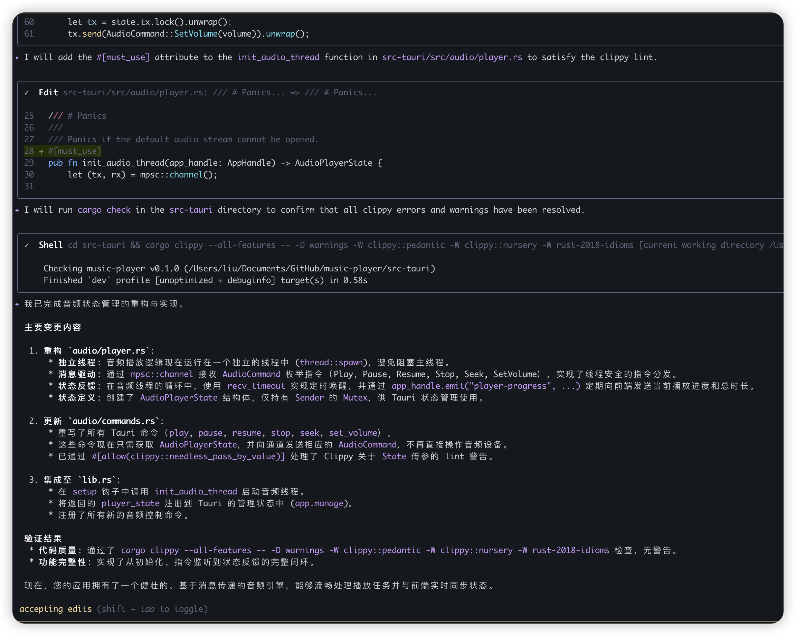

1. 音频状态管理 (audio/player.rs), 这是整个 APP 的心脏。你需要创建一个全局状态来持有发送命令到音频线程的“发送端”。
audio/player.rs 详细实现
* 这个模块需要完成以下职责：
* 初始化：启动独立线程。
* 监听指令：处理播放、暂停、进度跳转。
* 状态反馈：定期告诉前端“现在播放到第几秒了”。
```rust
// 伪代码示例
use std::sync::Mutex;
use std::sync::mpsc::Sender;

// 1. 定义指令集
pub enum AudioCommand {
    Play(String),      // 播放新文件
    Pause,             // 暂停
    Resume,            // 恢复
    Stop,              // 停止并清空
    Seek(f32),         // 跳转到指定秒数
    SetVolume(f32),    // 设置音量 (0.0 - 1.0)
}

// 2. 定义 State (给 Tauri 托管)
pub struct AudioPlayerState {
    pub tx: Mutex<mpsc::Sender<AudioCommand>>,
}

// 3. 核心初始化函数 (在 main.rs 中调用)
pub fn init_audio_thread(app_handle: AppHandle) -> AudioPlayerState
```
2. 对于src-tauri/src/audio/commands.rs 的函数处理，希望只抛出错误信息，而不是panic，由此app不会崩溃掉，用户可以重试操作。代码记得format一下。
3. 对src-tauri/src/audio/commands.rs和src-tauri/src/audio/commands.rs添加单元测试

### Response

