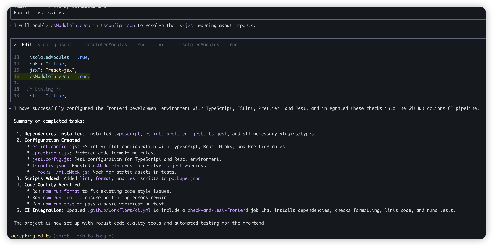

### Add lint, format, test config for frontent code
为前端代码添加typescript eslint, 并添加 code format 规则 和 unit test，并将这些命令集成到.github/workflows/ci.yml 中。
gemini suggestion
1. 安装依赖: `npm install --save-dev typescript eslint prettier eslint-config-prettier eslint-plugin-prettier jest ts-jest @types/jest`
2. 配置ESLint: 创建 `.eslintrc.js` 文件，配置TypeScript和Prettier规则。
3. 配置Prettier: 创建 `.prettierrc.js` 文件，定义代码格式化规则。
4. 配置Jest: 创建 `jest.config.js` 文件，配置TypeScript单元测试。
5. 添加脚本: 在 `package.json` 中添加 `lint`, `format`, `test` 脚本。
6. 集成CI: 修改 `.github/workflows/ci.yml`，添加运行 `lint`, `format`, `test` 的步骤。

### Response

