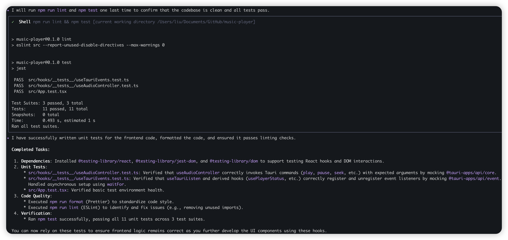

### 
1. 在 src-tauri/src/audio/player.rs 文件中，app_handle.emit 调用了前端的function, 请在src/hooks 中添加
tauri listen function，和参数类型，返回类型。
2. 在src-tauri/src/audio/commands.rs 中，将这些前端可调用的function添加到src/hooks 中，并添加参数类型，返回类型
gemini suggestion
3. Define frontend event listeners in `src/hooks/useTauriEvents.ts`.
4. Implement `useTauriListen` hook for frontend event subscription.
5. Specify event payload types for `emit` calls in `player.rs`.
6. Expose backend functions as Tauri commands in `commands.rs`.
7. Add argument and return types for exposed commands.
8. Ensure type safety between frontend and backend.

为添加的代码编写单元测试。并执行code format, eslint。
- **测试框架:** Jest
- **测试范围:** 核心功能
- **代码格式化:** Prettier
- **代码检查:** ESLint
- **执行命令:** `npm test`, `npm run format`, `npm run lint`

### Response

